# Synora: An Open ACR Data Platform

**A privacy-preserving Automatic Content Recognition platform for smart TV ecosystems — from on-device fingerprinting to audience monetization.**

---

## What ACR Solves

Most TV advertising still flies blind. When a spot runs on a broadcast or streaming channel, the advertiser rarely knows *which specific households saw it*, what else those households were watching that evening, or how to reach the same audience again with a follow-up creative. Automatic Content Recognition (ACR) closes that gap: by identifying what a TV is playing, second by second, platforms can build addressable audience segments and attach real delivery data to every impression.

A small number of TV manufacturers operate their own vertically integrated ACR stacks, and they monetize the resulting data at premium CPMs. For everyone else — the long tail of smart-TV OEMs, streaming-stick vendors, and set-top-box makers — the economic path to that same data is effectively closed, because building the pipeline end-to-end requires an SDK, a reference content database, a matching engine, a segmentation layer, an RTB front door, and a privacy/compliance program. That is a lot of distinct engineering and legal work to justify for any one OEM.

Synora is a reference architecture for this end-to-end system: a turnkey ACR SDK that a manufacturer can embed in firmware, a cloud platform that handles fingerprint matching, audience segmentation, and bidding integration, and a revenue-share model that aligns incentives between the platform operator and OEM partners.

The defensibility of an ACR platform is not the algorithm — the algorithms are well understood — but the combination of device footprint, content reference data, and compliance posture. Those compound slowly.

---

## What Synora Does

At its core, Synora answers one question at scale: *"What is this TV playing right now?"*

On each integrated device, the SDK periodically captures a short audio snippet from the TV's audio bus, converts it into a one-way fingerprint hash, and batches these fingerprints for transmission. In the cloud, the platform matches each incoming fingerprint against a reference database of broadcast and streaming content. When a match lands, the platform knows a specific (anonymized) device watched a specific program at a specific moment. Aggregated across millions of devices, this produces a granular view of TV viewership suitable for audience segmentation and addressable advertising.

The important design constraint is what the platform does *not* collect:

- Raw audio never leaves the device.
- Full IP addresses are truncated before storage.
- Hardware identifiers (MAC, serial) are never transmitted.
- Device IDs are derived through a salted hash that rotates on a monthly schedule, so the same physical device cannot be re-linked across months without a compromise of the salting infrastructure.

Privacy is a first-class design constraint, not a feature bolted on at the end.

---

## Platform Architecture

Synora is a distributed, cloud-native system designed around stream processing. The data path is append-only, every component is independently scalable, and the boundaries between services are either HTTP (for request/response) or Kafka (for fan-out).

### System Architecture Overview

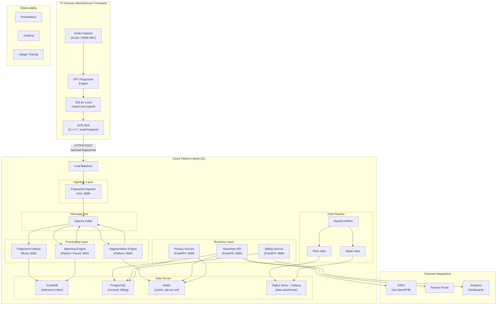

### Technology Stack at a Glance

| Layer | Technology | Why This Choice |
|---|---|---|
| **Device SDK** | C++17, ALSA, SQLite | Runs on constrained TV hardware, small binary, cross-platform |
| **Ingestion** | Go | High-throughput HTTP, low memory overhead, good fit for I/O-heavy services |
| **Message Bus** | Apache Kafka | High-throughput durable log, multi-consumer fan-out, replayable |
| **Matching** | Python (Faust streams) | Stateful stream processing with RocksDB, rapid iteration |
| **Indexing** | Rust | Memory safety, predictable latency, efficient ScyllaDB driver |
| **Fingerprint DB** | ScyllaDB | Wide-column store with predictable low-latency lookups |
| **APIs** | Python (FastAPI) | Async request handling, auto-generated OpenAPI docs |
| **Data Warehouse** | Apache Iceberg on object storage | ACID on cheap storage, schema evolution, time-travel queries |
| **Stream Processing** | Apache Flink | Exactly-once semantics, event-time windowing |
| **Batch Processing** | Apache Spark | Large-scale aggregation and retention jobs |
| **Orchestration** | Apache Airflow | DAG-based scheduling, backfill, alerting |
| **Frontend** | React 18 + TypeScript | Dashboard for campaign and segment management |
| **Infrastructure** | Terraform + Helm + Kubernetes | Reproducible, versioned cloud infrastructure |

---

## The Fingerprint Pipeline: From Sound Wave to Match

The heart of the platform is the journey of a single audio fingerprint from capture on a TV to a matched viewership event the rest of the system can reason about.

### End-to-End Data Flow

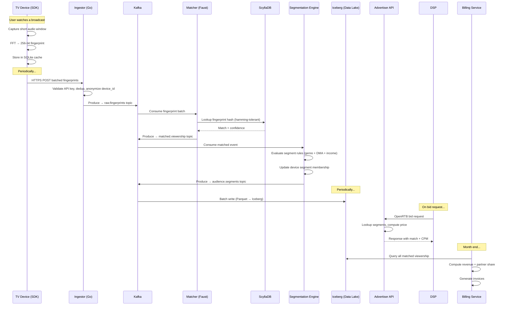

### What Happens at Each Stage

**Stage 1 — Audio capture & fingerprinting (on-device).** The SDK captures a short audio sample from the HDMI audio bus or the platform's native audio capture API, downmixes to mono, runs an FFT, and reduces the result to a compact fingerprint hash. The hash is deterministic (the same audio always produces the same hash) but irreversible (the original audio cannot be reconstructed from it).

**Stage 2 — Batch transmission.** Fingerprints accumulate in an encrypted SQLite cache on the device that survives reboots and offline periods. The SDK batches fingerprints into a single HTTPS POST on a fixed cadence. When the network is unavailable, the cache holds a bounded number of fingerprints and retries with exponential backoff.

**Stage 3 — Ingestion & validation (Go service).** The Go-based ingestor receives batches, validates the API key, deduplicates repeats within a short window, anonymizes the device ID with a monthly rotating salt, and produces individual messages onto the `raw.fingerprints` Kafka topic. It is designed to scale horizontally behind a load balancer.

**Stage 4 — Content matching (Python/Faust).** The matching engine consumes from `raw.fingerprints`, performs a hamming-tolerant lookup against the reference index in ScyllaDB, scores the match, and emits `matched.viewership` events. Fingerprints that do not match any reference go to an unmatched queue for late-arrival handling.

**Stage 5 — Audience segmentation (Python).** Matched viewership events flow into the segmentation engine, where a rule engine combines genre, geography (DMA), household income bracket, and behavioral signals to place devices into advertiser-defined cohorts. Segment membership is pushed to Redis for fast lookup during bid requests.

**Stage 6 — Data warehouse (Iceberg on object storage).** All events — raw fingerprints, matched viewership, segment transitions — land in Iceberg tables in Parquet columnar format. This provides ACID transactions, schema evolution, and time-travel queries over a large-scale data lake on commodity object storage.

**Stage 7 — Monetization (OpenRTB).** When a demand-side platform sends a bid request targeting a segment, the advertiser API consults Redis segment state and responds with a match decision and price. CPMs scale with segment narrowness: common segments are priced cheaply, rare intersections command premiums.

**Stage 8 — Revenue & billing.** At month end, the billing service queries the warehouse for all matched viewership attributed to each partner, computes revenue, applies the partner share, and generates invoices.

---

## The SDK

The SDK is the foundational piece — an embedded C++17 library designed to run on resource-constrained smart-TV hardware.

### SDK Architecture

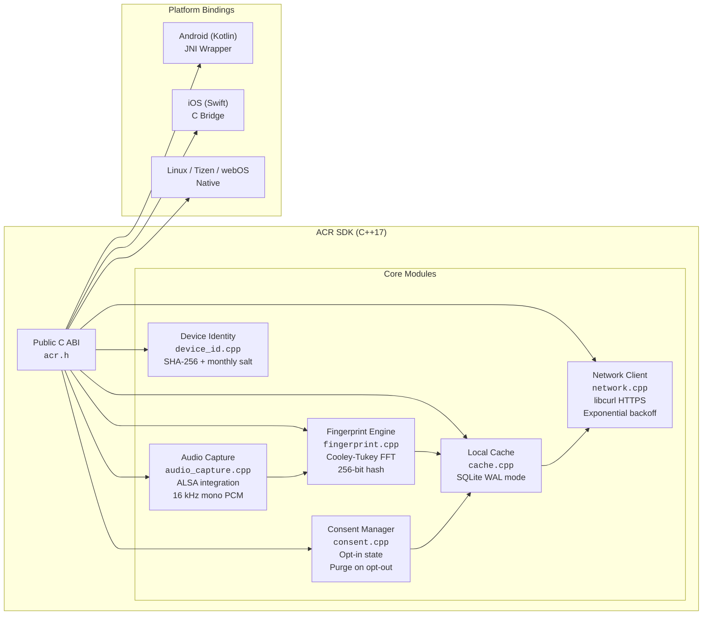

### SDK Design Targets

| Property | Target |
|---|---|
| Binary size | Small (single-digit MB) |
| Memory footprint | Low tens of MB RAM |
| CPU usage | Low single-digit percent on a background thread |
| Audio sample | Short window (~3 s) captured on a periodic cadence |
| Transmission | Batched fingerprints over HTTPS |
| Bandwidth | ~1 KB per minute sustained |
| Local cache | Bounded, survives reboot |
| Encryption | TLS for transport, encrypted local cache |
| Platforms | Android TV, Tizen, webOS, Linux-based TV OSes |

### SDK State Machine

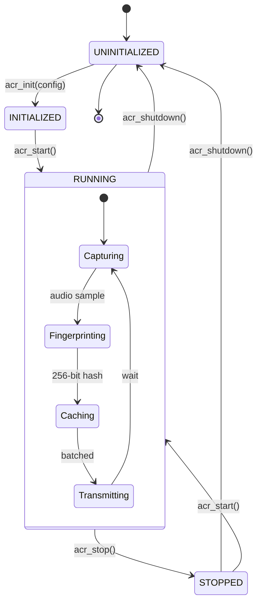

### Integration (C)

```c
#include "acr.h"

acr_config config = {
    .api_key = "partner_key_...",
    .endpoint = "https://ingest.synora.example",
};
acr_init(&config);

// Start capturing after the user has opted in.
acr_set_consent(true);
acr_start();

// On opt-out, purge local cache and stop capture.
acr_set_consent(false);
```

---

## Microservices Overview

### Service Communication Map


### Service Design Targets

| Service | Language | Latency target (p99) | Throughput target | Scaling |
|---|---|---|---|---|
| Fingerprint Ingestor | Go | Tens of ms | Hundreds of thousands of FP/sec | Horizontally scaled HTTP workers |
| Fingerprint Indexer | Rust | Low tens of ms (writes) | Hundreds of thousands of ops/sec | Kubernetes pods |
| Matching Engine | Python (Faust) | Low hundreds of ms | Hundreds of thousands of FP/sec | Kubernetes pods, partitioned by device |
| Segmentation Engine | Python | Seconds (micro-batch) | Hundreds of thousands of events/sec | Kubernetes pods |
| Advertiser API | Python (FastAPI) | Single-digit ms on RTB path | Low tens of thousands req/sec | Kubernetes pods, read-from-cache |
| Privacy Service | Python (FastAPI) | Hundreds of ms | Thousands of req/sec | Kubernetes pods |
| Billing Service | Python (FastAPI) | Seconds (batch) | Low hundreds of req/sec | Kubernetes pods, warehouse-backed |

---

## Privacy Architecture: Compliance by Design

Privacy is a foundational design constraint. Every architectural decision runs through a privacy filter first.

### Privacy Data Flow

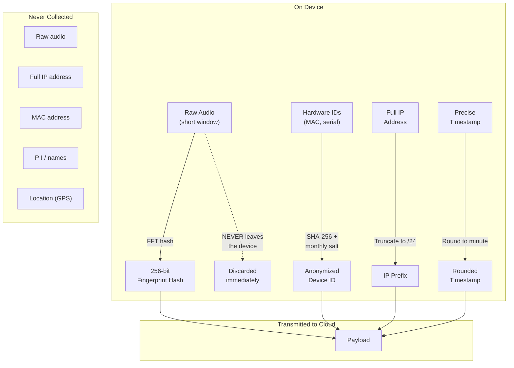

### Consent & Compliance Flow

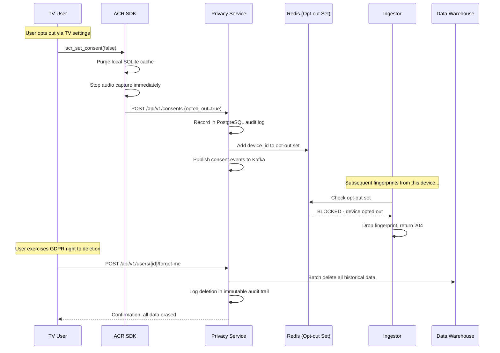

### Regulatory Compliance Matrix

| Regulation | Requirement | Design Approach |
|---|---|---|
| **GDPR** (EU) | Right to access | Privacy service exports all user data from the warehouse |
| **GDPR** (EU) | Right to deletion | Batch delete via Iceberg ACID transactions |
| **GDPR** (EU) | Data minimization | No raw audio, no PII, truncated IPs, rounded timestamps |
| **CCPA** (California) | Opt-out of sale | Redis opt-out set checked at ingestion; immediate enforcement |
| **CCPA** (California) | Disclosure | OpenAPI docs enumerate all collected data fields |
| **PIPEDA** (Canada) | Meaningful consent | SDK requires explicit opt-in before first capture |
| **TCF 2.0** (IAB) | Vendor consent | Privacy service parses TC strings, enforces per-vendor rules |
| **COPPA** (Children) | Age verification | Partner responsible; SDK provides age-gate callback |

These rows describe the *design* for compliance. Real-world certification and legal opinion for each jurisdiction remain the responsibility of the platform operator.

---

## Data Pipeline Architecture

Beyond the real-time streaming layer, Synora runs batch pipelines for analytics, data quality, and operational tasks.

### Pipeline Orchestration

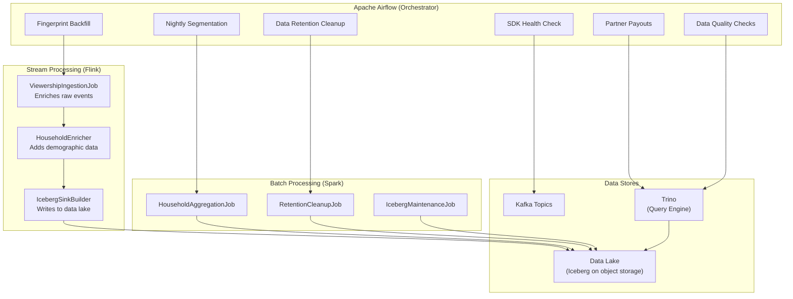

### Key Pipeline Jobs

**Nightly segmentation (Spark)** recomputes household-level audience segments by aggregating the previous 24 hours of matched viewership. It catches transitions the real-time engine missed and ensures segment state is consistent for downstream billing.

**Data retention cleanup (Spark)** enforces TTL policies: raw fingerprints beyond the retention window, matched viewership beyond a longer retention window, and aggregated segments beyond a multi-year window are purged from Iceberg using ACID delete transactions.

**Partner payouts (Airflow + Trino)** runs on a monthly cadence, queries the warehouse for all matched viewership attributed to each partner, computes revenue shares, and triggers invoicing.

**Data quality checks (Airflow + Trino)** validates completeness, watches for anomalies in fingerprint match rates, and alerts when any partner's devices show unexpected drops in data volume.

---

## Infrastructure & Deployment

### Cloud Infrastructure

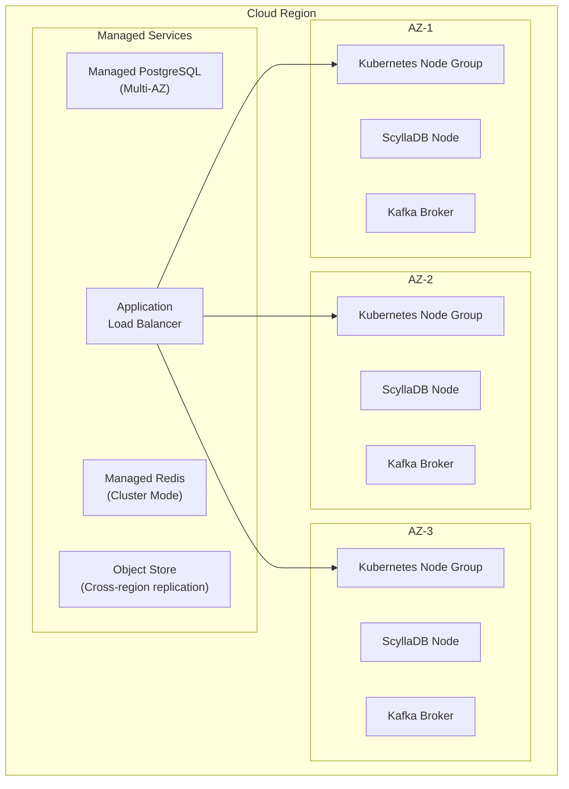

### Deployment Pipeline

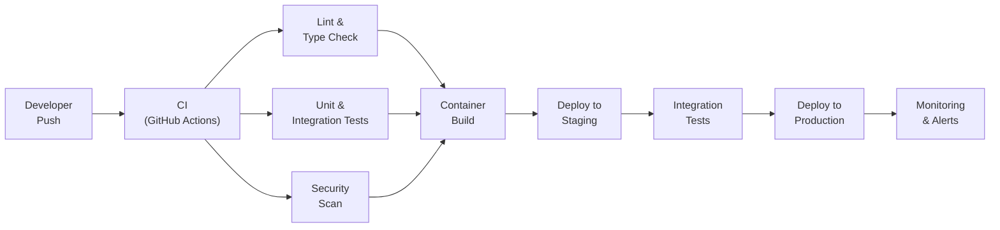

### Infrastructure Modules

The infrastructure is codified as a set of Terraform modules:

| Module | Resources | Purpose |
|---|---|---|
| **Kubernetes** | Cluster, node groups, IAM roles | Runs all microservices |
| **PostgreSQL** | Multi-AZ managed instance, parameter groups, backups | Consent, billing, advertiser data |
| **Object Storage** | Buckets, lifecycle policies, replication rules | Data lake, audit logs, backups |
| **Kafka** | Brokers, topics, security groups | Event streaming backbone |
| **Redis** | Cluster, parameter groups | Caching, opt-out set, segment lookup |

---

## Observability & Reliability

### Monitoring Stack

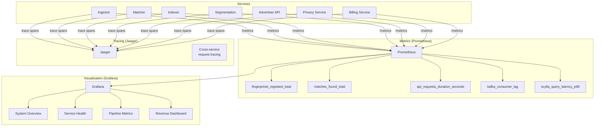

### Disaster Recovery Design

| Component | Backup | Frequency | RTO target | RPO target |
|---|---|---|---|---|
| ScyllaDB | Snapshots to object storage | Daily | Hours | 24 hours |
| PostgreSQL | Binary replication | Continuous | Minutes | ~0 |
| Kafka | Replication factor 3 | Real-time | 0 | 0 |
| Data Lake | Cross-region replication | Continuous | 0 | 0 |
| Redis | Rebuildable | N/A | Minutes | N/A |

---

## Scaling

Synora is designed to scale horizontally at every layer. As device footprint grows, the pattern is to add capacity — never to rewrite.

### Scaling Trajectory

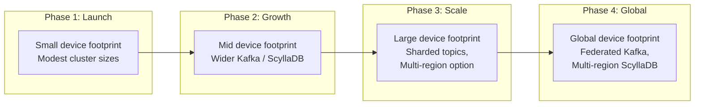

Every component is independently scalable: Kafka brokers join with zero downtime (automatic rebalance), ScyllaDB nodes join the ring with streaming rebalance (no locks), and Kubernetes services auto-scale on CPU utilization and Kafka consumer lag.

---

## Defensibility

The hard parts of an ACR platform are not the algorithms — those are well understood in the literature. The things that compound slowly and are hard to replicate:

**Device footprint.** More integrated devices means richer signal. Richer signal supports finer segments. Finer segments attract advertiser demand. Demand funds partner revenue share, which attracts more integrations. Getting this wheel spinning is the main business problem.

**Reference content database.** A usable reference index requires continuous ingestion of broadcast and streaming content and careful management of licensing. A new entrant cannot match a single fingerprint without this corpus.

**Privacy and compliance infrastructure.** Consent management, audit logs, GDPR/CCPA deletion workflows, and TCF 2.0 integration represent real engineering and legal work. Getting this wrong produces regulatory exposure that no OEM partner will accept.

**Partner integration inertia.** Once a partner has embedded the SDK in firmware, validated it through QA, and started receiving revenue, the switching cost is high. Firmware updates on smart TVs are slow and risky.

---

## Getting Started

### For Developers

```bash
# Clone the repo
git clone https://github.com/synora/acraas.git
cd acraas

# Start the full platform locally
cp .env.example .env
docker-compose up -d
./docker-compose.init.sh

# Access the services
open http://localhost:3000     # Advertiser dashboard
open http://localhost:3001     # Grafana (admin/admin)
open http://localhost:8089     # Airflow
```

See `docs/sdk-integration-guide.md` for SDK integration, `docs/ARCHITECTURE.md` for the full system design, and `docs/api-reference.md` for the platform API.

### For Partners

The partner onboarding flow has four stages: integration agreement, SDK integration into firmware, QA validation against the integration test suite, and OTA rollout to an installed base. Ongoing payouts are handled through the billing service against a configurable revenue-share split.

### For Advertisers

The advertiser flow has three stages: account creation and API key provisioning, segment definition through the dashboard or segment-builder DSL, and OpenRTB integration with the demand-side platforms of choice. Delivery reporting is surfaced in the dashboard.

---

## Roadmap

Synora's present scope is fingerprint capture, matching, segmentation, and monetization. Areas the architecture extends naturally into:

**Cross-device graph.** Linking TV viewership to mobile and desktop behavior through probabilistic device graphs, enabling cross-screen attribution.

**Content-level insights.** Moving beyond *what show* to *what scene* and *what ad* recognition, enabling competitive ad intelligence and creative optimization.

**International expansion.** Adapting the platform for jurisdictions with stricter or region-specific privacy frameworks and content databases.

**ML-powered segmentation.** Replacing rule-based segments with learned models that discover high-value audience clusters automatically.

**Real-time attribution.** Closing the loop between TV ad exposure and downstream behavior.

---
