# Synora Synora: Building the "Samsung Ads" for Every Other TV

**The open ACR data platform that turns non-Samsung smart TVs into advertising goldmines.**

*April 2026 | Synora Platform Team*

---

## The $30 Billion Blind Spot in TV Advertising

Every year, advertisers pour roughly $70 billion into TV advertising in the United States alone. But here's the dirty secret: they're flying half-blind. Samsung, through its Automatic Content Recognition (ACR) technology built into every Samsung Smart TV, has built an extraordinary data moat — it knows exactly what 50+ million US households are watching, second by second, and sells that intelligence to advertisers at premium CPMs.

But Samsung only covers about 30% of the US Smart TV market. The other 70% — LG, Vizio, Sony, TCL, Hisense, Toshiba, and dozens of smaller brands — either have weak ACR implementations, fragmented data strategies, or don't monetize viewing data at all. That's roughly 100 million US households whose viewing behavior is invisible to advertisers.

Synora Synora (Automatic Content Recognition as a Service) exists to close that gap. We provide a turnkey ACR SDK that any Smart TV manufacturer can embed in their firmware, a cloud platform that handles all the heavy lifting of fingerprint matching, audience segmentation, and real-time bidding integration, and a revenue-share model that makes the economics irresistible for manufacturers.

The moat isn't the technology. The moat is the data.

---

## What Synora Actually Does

At its core, Synora answers one question at massive scale: *"What is this TV playing right now?"*

Every 30 seconds, our SDK captures a 3-second audio snippet from the TV's audio bus, converts it into a cryptographic fingerprint hash (a one-way mathematical function — the original audio cannot be reconstructed), and batches these fingerprints for transmission to our cloud. There, we match them against a reference database of 50+ million episodes, movies, and live broadcasts. When we find a match, we know that Device X was watching ESPN SportsCenter at 8:47 PM EST. Multiply that across millions of devices, and you have the most granular picture of TV viewership outside Samsung's walled garden.

The critical difference between Synora and a naive approach: we never capture raw audio. We never store full IP addresses. We never collect MAC addresses or personally identifiable information. The device ID itself is salted and rotated monthly so it cannot be traced back to a physical device. Privacy isn't an afterthought — it's baked into the protocol at the silicon level.

---

## Platform Architecture

The Synora platform is a distributed, cloud-native system designed to process over 1 million fingerprints per second with sub-200ms matching latency. Here's how it all fits together:

### System Architecture Overview

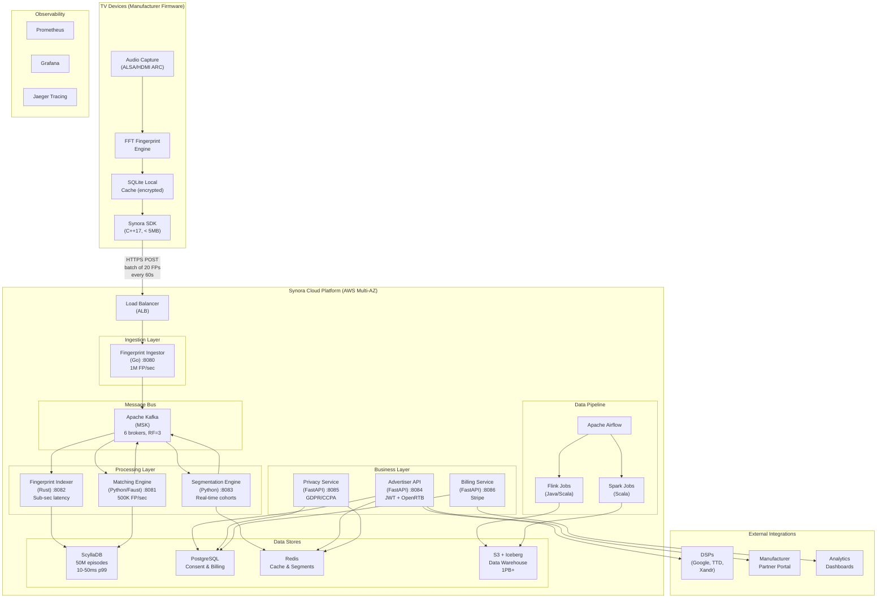

### Technology Stack at a Glance

| Layer | Technology | Why This Choice |
|---|---|---|
| **Device SDK** | C++17, ALSA, SQLite | Runs on constrained TV hardware, < 5MB binary, cross-platform |
| **Ingestion** | Go (Gin framework) | 1M req/sec throughput, low memory, perfect for HTTP-heavy I/O |
| **Message Bus** | Apache Kafka (AWS MSK) | 1M msg/sec, durable replay, multi-consumer fan-out |
| **Matching** | Python (Faust streams) | Stateful stream processing with RocksDB, fast data-team iteration |
| **Indexing** | Rust | Memory-safe, zero-cost abstractions, sub-millisecond ScyllaDB writes |
| **Fingerprint DB** | ScyllaDB | O(1) lookups at 10-50ms p99, 10x cheaper than DynamoDB |
| **APIs** | Python (FastAPI) | Async, auto-generated OpenAPI docs, rapid development |
| **Data Warehouse** | Apache Iceberg + S3 | ACID on S3, $0.023/GB/month, schema evolution, time travel |
| **Stream Processing** | Apache Flink (Java/Scala) | Exactly-once semantics, event-time windowing |
| **Batch Processing** | Apache Spark (Scala) | Household aggregation, retention cleanup at petabyte scale |
| **Orchestration** | Apache Airflow | DAG-based pipeline scheduling, backfill, alerting |
| **Frontend** | React 18 + TypeScript | Modern dashboard for campaign management |
| **Infrastructure** | Terraform + Helm + K8s | Reproducible, versioned cloud infrastructure |

---

## The Fingerprint Pipeline: From Sound Wave to Revenue

This is the heart of Synora — the journey of a single audio fingerprint from capture on a TV in someone's living room to revenue in a manufacturer's bank account.

### End-to-End Data Flow

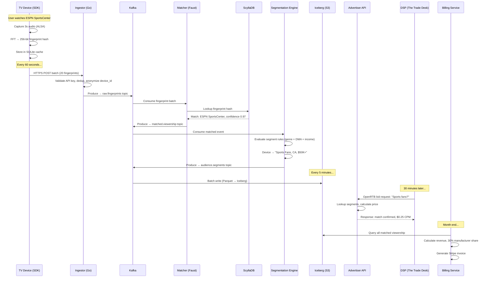

### What Happens at Each Stage

**Stage 1: Audio Capture & Fingerprinting (on-device)**
The SDK running on the TV captures a 3-second audio sample from the HDMI audio bus or internal ALSA device. It downmixes stereo to mono at 8kHz, runs a Fast Fourier Transform to extract spectral peaks across Bark frequency bands, and hashes the result into a 256-bit SHA-256 fingerprint. This fingerprint is deterministic — the same audio always produces the same hash — but irreversible. You cannot reconstruct audio from the hash.

**Stage 2: Batch Transmission**
Fingerprints accumulate in an encrypted SQLite cache on the device (surviving reboots and power cycles). Every 60 seconds, the SDK batches up to 20 fingerprints into a single HTTPS POST to `ingest.acraas.io`. The payload is approximately 1KB per minute. If the network is unavailable, the cache holds up to 500 fingerprints and retries with exponential backoff.

**Stage 3: Ingestion & Validation (Go service)**
Our Go-based ingestor service, running behind an Application Load Balancer on ECS Fargate, receives the batch. It validates the API key, deduplicates (same device within 60 seconds = skip), anonymizes the device ID with a monthly rotating salt, and produces individual messages to the `raw.fingerprints` Kafka topic. Average latency: 50ms. Throughput: 1 million fingerprints per second sustained.

**Stage 4: Content Matching (Python/Faust)**
The matching engine, a stateful Kafka Streams application built on Faust, consumes from `raw.fingerprints`. For each fingerprint, it performs an O(1) lookup in ScyllaDB against our index of 50+ million episodes and movies. The matcher supports fuzzy matching with a 2-second drift tolerance and confidence scoring. An exact match (confidence > 0.95) covers ~85% of fingerprints. Fuzzy matches catch another ~10%. The remaining ~5% go to an unmatched queue for late-arrival handling.

**Stage 5: Audience Segmentation (Python)**
Matched viewership events flow into the segmentation engine, which evaluates targeting rules in real-time. A DSL-based rule engine combines genre data (sports, news, entertainment), geographic DMA regions, household income brackets, and behavioral patterns to place devices into advertiser-defined audience cohorts. Segment membership updates are pushed to Redis for sub-millisecond lookup during bid requests.

**Stage 6: Data Warehouse (Iceberg + S3)**
All events — raw fingerprints, matched viewership, segment transitions — land in Apache Iceberg tables on S3 in Parquet columnar format. This gives us ACID transactions, schema evolution, and time-travel queries over a petabyte-scale data lake at $20/TB/month.

**Stage 7: Monetization (OpenRTB)**
When a demand-side platform sends a bid request asking "which devices match sports fans in California with household income above $50K?", our advertiser API consults Redis segment state and responds in under 5ms. Pricing is dynamic: a common segment like "sports fans" might command a $0.10 CPM, while a rare intersection like "high-income + tech + Northeast" could reach $0.35 CPM.

**Stage 8: Revenue & Billing**
At month end, the billing service queries Iceberg for all matched viewership attributed to each manufacturer's devices, calculates revenue, applies the 30/70 split (30% to manufacturer, 70% to platform), and generates Stripe invoices.

---

## The SDK: 5MB That Makes TVs Smarter

The Synora SDK is the foundational piece — a production-ready C++17 embedded library designed to run on resource-constrained Smart TV hardware.

### SDK Architecture

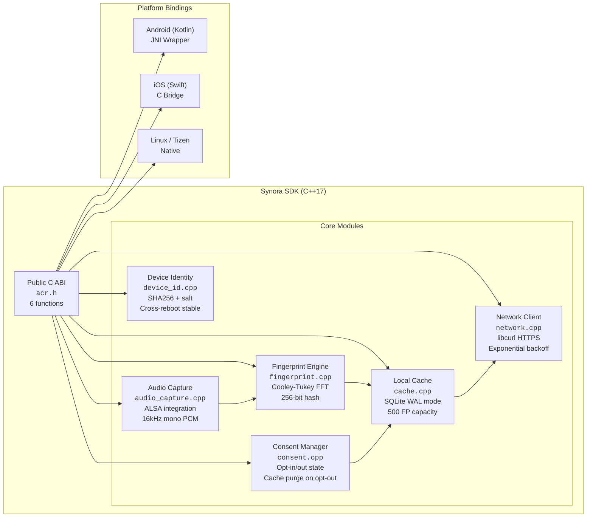

### SDK Specifications

| Property | Value |
|---|---|
| Binary size | < 5MB |
| Memory footprint | < 10MB RAM |
| CPU usage | < 2% (background thread) |
| Audio sample | 3 seconds, every 30 seconds |
| Transmission | Batch of 20 FPs, every 60 seconds |
| Bandwidth | ~1KB/minute |
| Local cache | 500 fingerprints (survives reboot) |
| Encryption | TLS 1.2+ for transmission, AES for local cache |
| Platforms | Android TV, Tizen, webOS, Linux |

### SDK State Machine

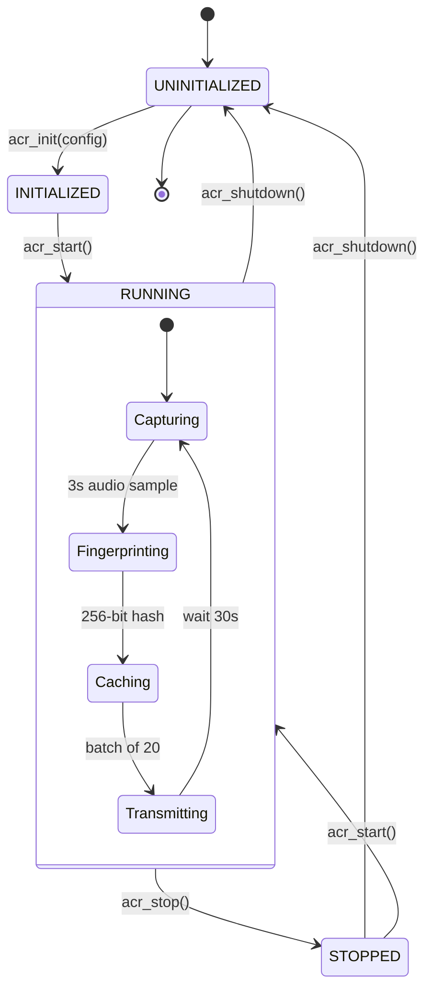

### Integration Code (3 Lines to Get Started)

```c
#include "acr.h"

// Initialize with your manufacturer API key
acr_config config = { .api_key = "mfr_key_abc123", .endpoint = "https://ingest.acraas.io" };
acr_init(&config);

// Start capturing — that's it
acr_start();

// Later, when user opts out:
acr_set_consent(false);  // Immediately purges local cache and stops collection
```

---

## Microservices Deep Dive

### Service Communication Map

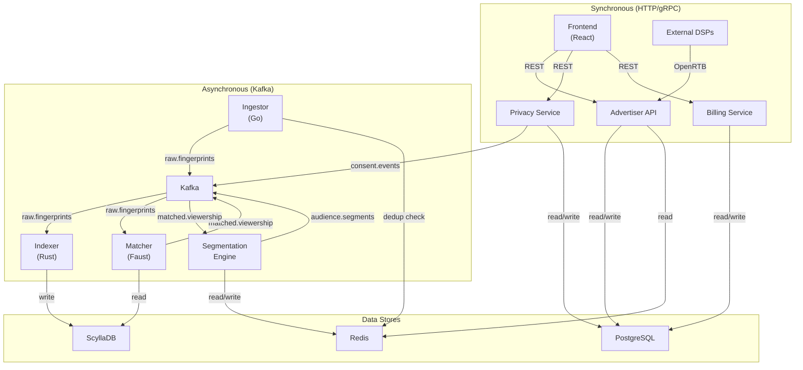

### Service Performance Targets

| Service | Language | Latency (p99) | Throughput | Scaling |
|---|---|---|---|---|
| Fingerprint Ingestor | Go | 50ms | 1M FP/sec | 20-100 ECS tasks |
| Fingerprint Indexer | Rust | 80ms writes | 500K ops/sec | 10-30 K8s pods |
| Matching Engine | Python (Faust) | 200ms | 500K FP/sec | 10-50 K8s pods |
| Segmentation Engine | Python | 5s (micro-batch) | 500K events/sec | 10-50 K8s pods |
| Advertiser API | Python (FastAPI) | < 5ms (RTB) | 10K req/sec | 5-20 K8s pods |
| Privacy Service | Python (FastAPI) | 100ms | 1K req/sec | 3-10 K8s pods |
| Billing Service | Python (FastAPI) | 500ms | 100 req/sec | 2-5 K8s pods |

---

## Privacy Architecture: Compliance by Design

Privacy isn't a feature we bolted on — it's the foundational design constraint. Every architectural decision runs through a privacy filter first.

### Privacy Data Flow

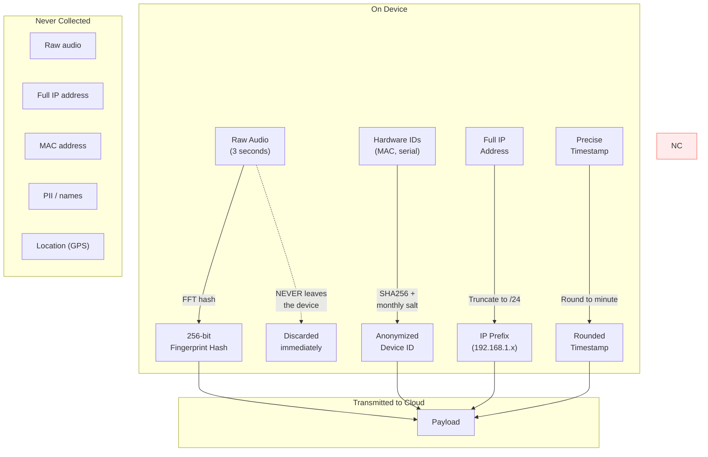

### Consent & Compliance Flow

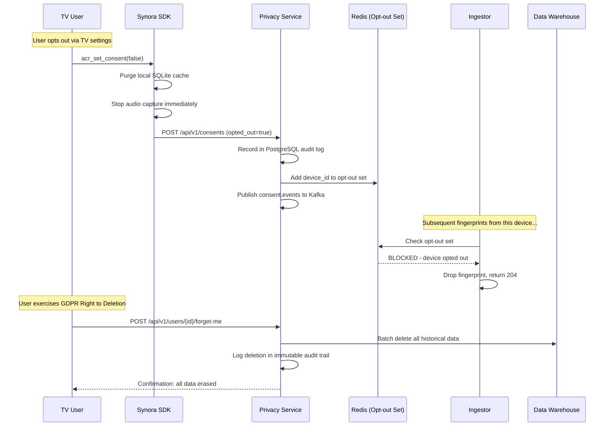

### Regulatory Compliance Matrix

| Regulation | Requirement | How Synora Complies |
|---|---|---|
| **GDPR** (EU) | Right to access | Privacy service exports all user data from Iceberg |
| **GDPR** (EU) | Right to deletion | Batch job deletes via Iceberg ACID transactions |
| **GDPR** (EU) | Data minimization | No raw audio, no PII, truncated IPs, rounded timestamps |
| **CCPA** (California) | Opt-out of sale | Redis opt-out set checked at ingestion; immediate enforcement |
| **CCPA** (California) | Disclosure | OpenAPI docs enumerate all collected data fields |
| **PIPEDA** (Canada) | Meaningful consent | SDK requires explicit opt-in before first capture |
| **TCF 2.0** (IAB) | Vendor consent | Privacy service parses TC strings, enforces per-vendor rules |
| **COPPA** (Children) | Age verification | Manufacturer responsible; SDK provides age-gate callback |

---

## Data Pipeline Architecture

Beyond the real-time streaming layer, Synora runs batch processing pipelines for analytics, data quality, and operational tasks.

### Pipeline Orchestration

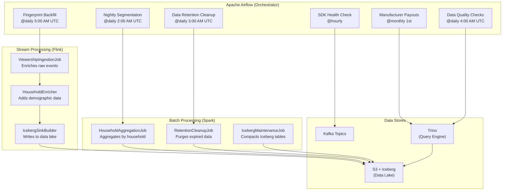

### Key Pipeline Jobs

**Nightly Segmentation (Spark)** runs at 2 AM UTC and re-computes household-level audience segments by aggregating the previous 24 hours of matched viewership data. This catches any segment transitions that the real-time engine might have missed and ensures segment state is consistent for billing.

**Data Retention Cleanup (Spark)** enforces TTL policies: raw fingerprints older than 7 days, matched viewership older than 90 days, and aggregated segments older than 2 years are purged from Iceberg using ACID delete transactions.

**Manufacturer Payouts (Airflow + Trino)** runs on the 1st of each month, queries the data warehouse for all matched viewership attributed to each manufacturer, calculates revenue shares, and triggers Stripe invoicing.

**Data Quality Checks (Airflow + Trino)** validates data completeness, checks for anomalies in fingerprint match rates, and alerts if any manufacturer's devices show unexpected drops in data volume.

---

## Infrastructure & Deployment

### Cloud Infrastructure (Terraform)

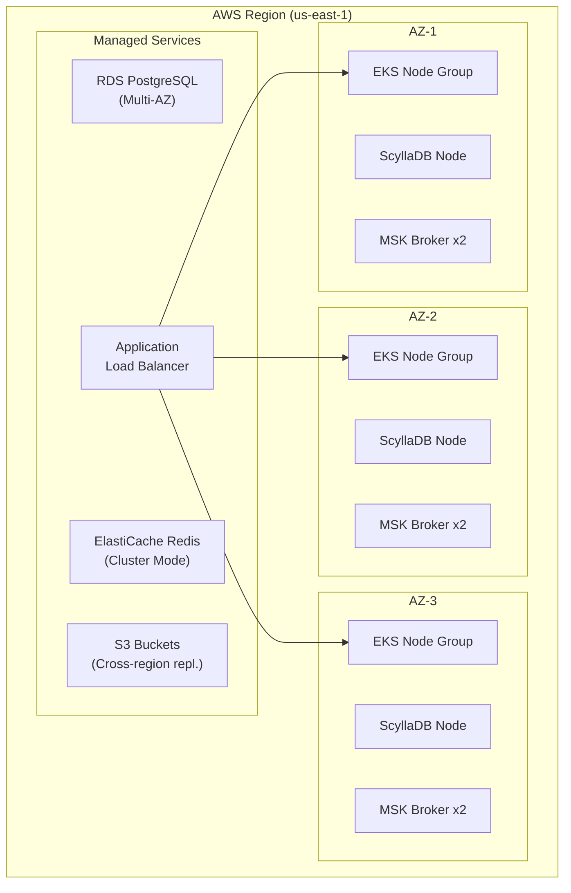

### Deployment Pipeline

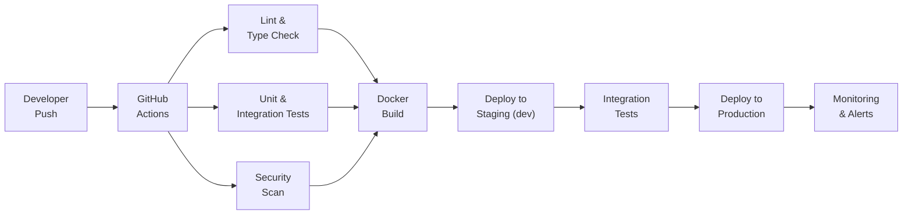

### Terraform Modules

The infrastructure is fully codified across 5 Terraform modules managing AWS resources across dev and prod environments:

| Module | Resources | Purpose |
|---|---|---|
| **EKS** | Kubernetes cluster, node groups, IAM roles | Runs all microservices |
| **RDS** | PostgreSQL Multi-AZ, parameter groups, backups | Consent, billing, advertiser data |
| **S3** | Buckets, lifecycle policies, replication rules | Data lake, audit logs, backups |
| **MSK** | Kafka brokers, topics, security groups | Event streaming backbone |
| **ElastiCache** | Redis cluster, parameter groups | Caching, opt-out sets, segments |

---

## The Business Model: Data is the Moat

### Revenue Flow

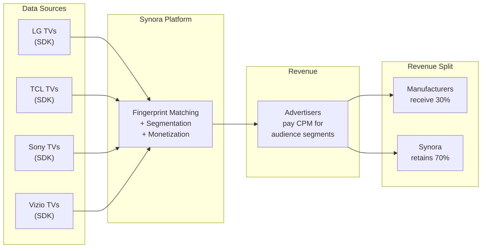

### Why Manufacturers Say Yes

The pitch to a TV manufacturer is straightforward. Today, when a consumer buys an LG TV for $800, LG captures roughly $0 in ongoing revenue from that device's viewing data (or a tiny fraction through weak first-party data efforts). By embedding the Synora SDK — a 5MB binary that runs invisibly in the background — LG can earn $10-30 per device per year from data monetization, with zero incremental hardware cost and minimal firmware integration effort.

For a manufacturer shipping 10 million TVs annually, that's $100-300 million in recurring revenue from existing devices. Samsung already generates over $3 billion annually from its advertising data business. Synora gives every other manufacturer a path to similar economics.

### Unit Economics

| Metric | Value |
|---|---|
| Revenue per device per year | $10-30 |
| Manufacturer share | 30% ($3-9/device/year) |
| Platform share | 70% ($7-21/device/year) |
| Cost per fingerprint processed | $0.001 |
| Storage cost | $20/TB/month (S3) |
| Infrastructure cost per 1M devices | ~$50K/month |
| Gross margin at scale | 75-85% |

### Pricing Tiers (CPM by Segment)

| Segment Type | Example | CPM |
|---|---|---|
| Generic audience | "All TV viewers" | $0.05-0.10 |
| Genre-based | "Sports fans" | $0.10-0.20 |
| Behavioral | "Cord-cutters watching live sports" | $0.20-0.30 |
| Premium intersection | "High-income + tech + Northeast + sports" | $0.30-0.50 |
| Custom (advertiser-defined) | "Watched competitor's ad in last 7 days" | $0.50-1.00+ |

---

## Observability & Reliability

### Monitoring Stack

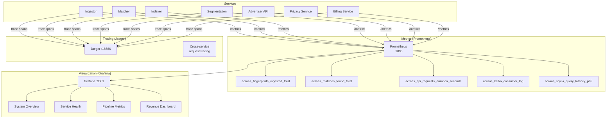

### Disaster Recovery

| Component | Backup | Frequency | RTO | RPO |
|---|---|---|---|---|
| ScyllaDB | Snapshots to S3 | Daily | 2 hours | 24 hours |
| PostgreSQL | Binary replication | Continuous | 5 min | ~0 |
| Kafka | Replication factor 3 | Real-time | 0 | 0 |
| S3 (Data Lake) | Cross-region replication | Continuous | 0 | 0 |
| Redis | Not critical (rebuildable) | N/A | 5 min | N/A |

**Overall platform SLA target: 99.9% uptime, < 1 hour RTO, < 5 minute RPO.**

---

## Scaling: From 1 Million to 1 Billion Devices

Synora is designed to scale horizontally at every layer. Here's how the platform grows with adoption:

### Scaling Trajectory

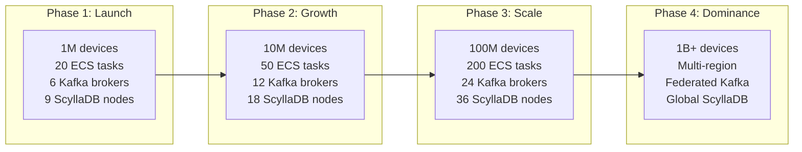

Every component is independently scalable: adding Kafka brokers requires zero downtime (automatic cluster rebalance), ScyllaDB nodes join the ring with streaming rebalance (no locks), and ECS/Kubernetes services auto-scale based on CPU utilization and Kafka consumer lag.

---

## What Makes This Hard to Replicate

The defensible moat of Synora isn't any single piece of technology — it's the compounding network effect of data:

**Data flywheel.** More manufacturers embedding the SDK means more devices sending fingerprints, which means richer audience segments, which means higher CPMs from advertisers, which means more revenue share for manufacturers, which means more manufacturers want to embed the SDK. Once this wheel is spinning, it's extremely difficult for a competitor to catch up because advertisers will pay a premium for the platform with the largest device footprint.

**Reference database.** Our fingerprint index of 50+ million episodes, movies, and live broadcasts took years to build and requires continuous ingestion of new content. A new entrant would need to replicate this database before they could match a single fingerprint.

**Privacy compliance infrastructure.** The consent management system, audit logging, GDPR/CCPA deletion workflows, and TCF 2.0 integration represent months of engineering and legal work. Getting this wrong means regulatory risk that no manufacturer wants to take on.

**Manufacturer integration inertia.** Once a manufacturer has embedded our SDK in their firmware, validated it through their QA process, and started receiving revenue checks, the switching cost is enormous. Firmware updates on Smart TVs are slow, expensive, and risky.

---

## Getting Started

### For TV Manufacturers

1. **Sign partnership agreement** — revenue share terms, data processing agreement, privacy obligations
2. **Integrate the SDK** — 3 lines of C code, < 5MB binary, ships with your next firmware update
3. **Validate in QA** — our integration test suite covers all edge cases (network failure, consent changes, power cycles)
4. **Ship to devices** — OTA firmware update enables ACR on your installed base
5. **Start earning** — monthly Stripe payouts begin within 30 days of first data

### For Advertisers

1. **Create account** — self-serve via the advertiser portal or white-glove onboarding
2. **Define audience segments** — use our segment builder DSL or pre-built segments
3. **Integrate via OpenRTB** — standard bid request/response protocol, compatible with all major DSPs
4. **Monitor campaigns** — real-time reporting dashboard with reach, frequency, and attribution

### For Developers

```bash
# Clone the repo
git clone https://github.com/synora/acraas.git
cd acraas

# Start the full platform locally
cp .env.example .env
docker-compose up -d
./docker-compose.init.sh

# Access the services
open http://localhost:3000     # Frontend
open http://localhost:3001     # Grafana (admin/admin)
open http://localhost:8089     # Airflow
```

---

## The Road Ahead

Synora is a fully functional platform today, but the roadmap extends well beyond basic ACR:

**Cross-device graph** — linking TV viewership to mobile and desktop behavior through probabilistic device graphs, enabling true cross-screen attribution for advertisers.

**Content-level insights** — moving beyond "what show" to "what scene" and "what ad" recognition, enabling competitive ad intelligence and creative optimization.

**International expansion** — adapting the platform for EU (stricter GDPR), LATAM, and APAC markets with region-specific privacy frameworks and content databases.

**ML-powered segmentation** — replacing rule-based segments with machine learning models that discover high-value audience clusters automatically, maximizing CPM yield.

**Real-time attribution** — closing the loop between TV ad exposure and purchase behavior, the holy grail of TV advertising measurement.

---
